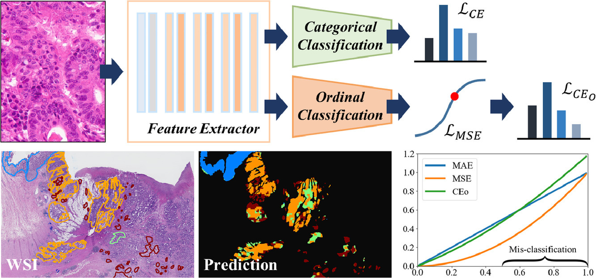

# JCO_Learning: Joint Categorical and Ordinal Learning for Cancer Grading in Pathology Images

A multi-task deep learning model for pathology image grading conducts categorical classification, and auxiliary ordinal classification for Cancer Grading in Pathology Images uses a L_CEO loss for the auxiliary ordinal task.

[Link](https://www.sciencedirect.com/science/article/pii/S1361841521002516) to Medical Image Analysis paper. <br />

All the models in this project were evaluated on the following datasets:

- [Colon_KSH]() (Colon TMA from Kangbuk Samsung Hospital - Available soon)
- [Colon_KSH]() (Colon WSI from Kangbuk Samsung Hospital - Available soon)
- [Prostate_UHU](https://dataverse.harvard.edu/dataset.xhtml?persistentId=doi:10.7910/DVN/OCYCMP) (Prostate TMA from University Hospital Zurich - Harvard dataverse)
- [Prostate_UBC](https://gleason2019.grand-challenge.org/) (Prostate TMA from UBC - MICCAI 2019)

Links to the checkpoints can be found in the inference description below.




## Set Up Environment

```
conda env create -f environment.yml
conda activate hovernet
pip install torch~=1.8.1+cu111
```

Above, we install PyTorch version 1.8.1 with CUDA 11.1. 
The code still work older Pytorch version (PyTorch >=1.1).
## Repository Structure

Below are the main directories in the repository: 

- `dataloader/`: the data loader and augmentation pipeline
- `docs/`: figures/GIFs used in the repo
- `misc/`: utils that are
- `model_lib/`: model definition, along with the main run step and hyperparameter settings  
- `script/`: defines the training loop 

Below are the main executable scripts in the repository:

- `config.py`: configuration file
- `config_validator.py`: still  configuration file but for validation/test phrase or generate the predicted maps
- `dataset.py`: defines the dataset classes 
- `train_val.py`: main training script
- `train_val_ceo_for_cancer_only.py`: still training script but ordinal loss only applied to cancer classes (benign class is excluded)
- `infer_produce_predict_map_wsi.py`: following sliding window fashion to generate a predicted map or probability map for WSI/core image 

# Running the Code

### Usage and Options
 
Usage: <br />
```
  python train_val.py [--gpu=<id>] [--run_info=<task_name + loss function>] [--dataset=<colon/prostate>]
```

Options:
** Our proposed and 9 common/state-of-the-art categorical and ordinal classification methods, including:**

| METHOD       | run_info             |  Description |
| -------------|----------------------| ----------------------|
| C_CE         | CLASS_ce             | Classification: Cross-Entropy loss
| C_FOCAL      | CLASS_FocalLoss      | Classification: Focal loss, Focal loss for dense object detection [[paper]](https://arxiv.org/abs/1708.02002)
| R_MAE        | REGRESS_mae          | Regression: MAE loss
| R_MSE        | REGRESS_mse          | Regression: MSE loss
| R_SL         | REGRESS_soft_label   | Regression: Soft-Label loss, Deep learning regression for prostate cancer detection and grading in Bi-parametric MRI [[paper]](https://ieeexplore.ieee.org/document/9090311)
| O_DORN       | REGRESS_rank_dorn    | Ordinal regression: Deep ordinal regression network for monocular depth estimation [[paper]](https://arxiv.org/abs/1806.02446) [[code]](https://github.com/hufu6371/DORN?utm_source=catalyzex.com)
| O_CORAL      | REGRESS_rank_coral   | Ordinal regression: Rank consistent ordinal regression for neural networks with application to age estimation [[paper]](https://arxiv.org/abs/1901.07884) [[code]](https://github.com/Raschka-research-group/coral-cnn?utm_source=catalyzex.com)
| O_FOCAL      | REGRESS_FocalOrdinal | Ordinal regression: Joint prostate cancer detection and Gleason score prediction in mp-MRI via FocalNet [[paper]](https://ieeexplore.ieee.org/document/8653866)
| M_MTMR       | MULTI_mtmr           | Multitask: Multi-task deep model with margin ranking loss for lung nodule analysis [[paper]](https://ieeexplore.ieee.org/document/8794587) [[code]](https://github.com/lihaoliu-cambridge/mtmr-net)
| M_MAE        | MULTI_ce_mae         | Multitask: Class_CE + Regression_MAE 
| M_MSE        | MULTI_ce_mse         | Multitask: Class_CE + Regression_MSE 
| M_MAE_CEO    | MULTI_ce_mae_ceo     | Multitask: Class_CE + Regression_MAE_CEO (Ours)
| M_MSE_CEO    | MULTI_ce_mae_ceo     | Multitask: Class_CE + Regression_MSE_CEO (Ours)


## Inference
Usage: <br />
```
  python infer_produce_predict_map_wsi.py [--gpu=<id>] [--run_info=<task_name + loss function>] 
```
  
### Model Weights

Model weights obtained from training MULTI_ce_mse_ceo here:
- [Colon checkpoint](https://drive.google.com/drive/folders/1Gf2HjjcjJw4h1VvFUbnF2xvr9SJ6_r48?usp=sharing)
- [Prostate checkpoint](https://drive.google.com/drive/folders/1Gf2HjjcjJw4h1VvFUbnF2xvr9SJ6_r48?usp=sharing)

Access the entire checkpoints [here](https://drive.google.com/drive/folders/1KQMD0iRibfAP9AxBE4TuU1NtPGvw-h5R?usp=sharing).

If any of the above checkpoints are used, please ensure to cite the corresponding paper.

## Authors

* [Vuong Thi Le Trinh](https://github.com/timmyvg)


## Citation

If any part of this code is used, please give appropriate citation to our paper. <br />

BibTex entry: <br />
```
@article{le2021joint,
  title={Joint categorical and ordinal learning for cancer grading in pathology images},
  author={Le Vuong, Trinh Thi and Kim, Kyungeun and Song, Boram and Kwak, Jin Tae},
  journal={Medical image analysis},
  pages={102206},
  year={2021},
  publisher={Elsevier}
}
```